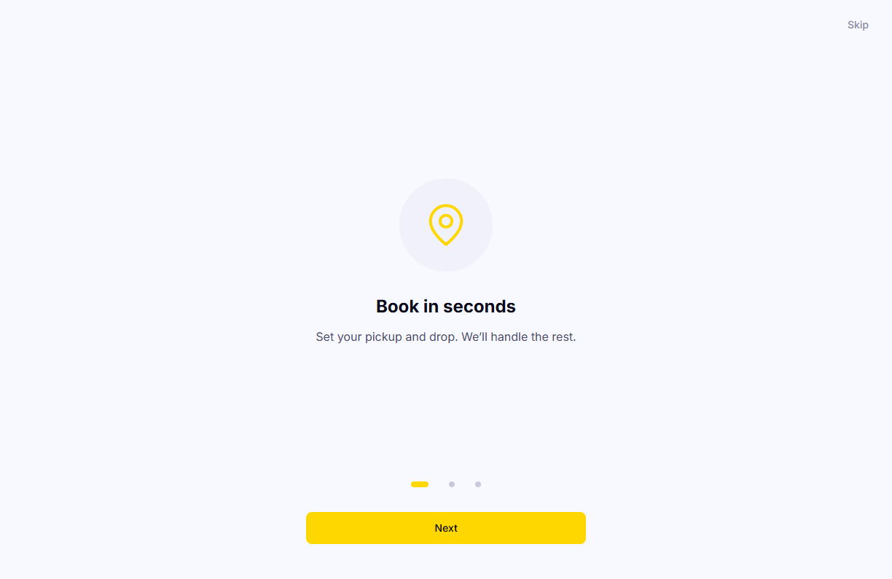
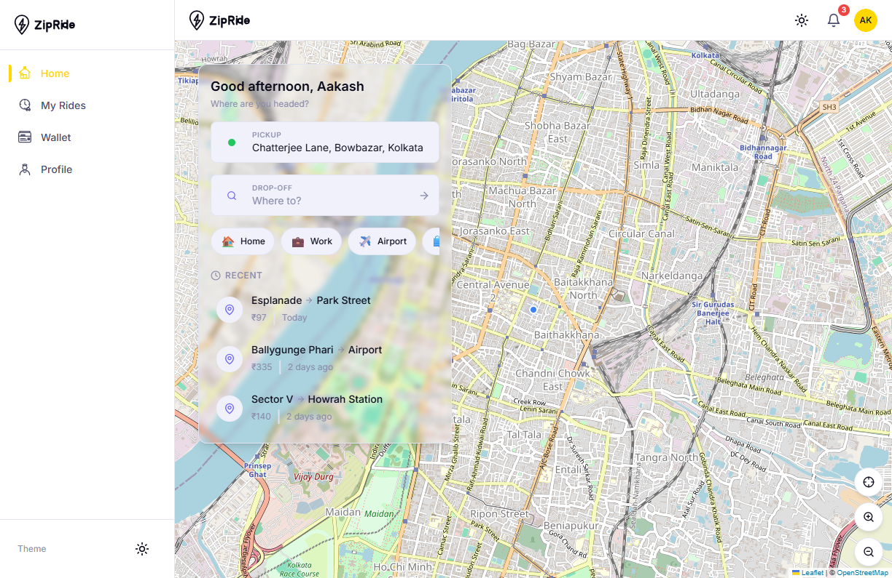
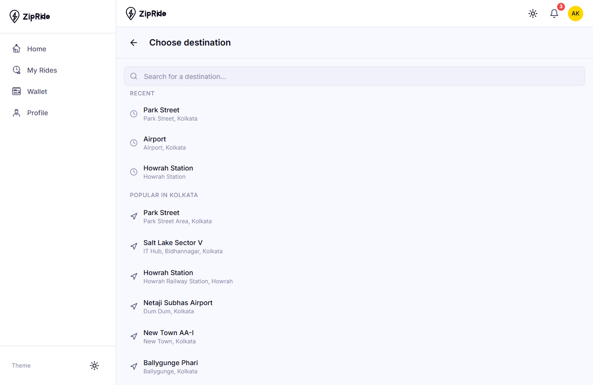
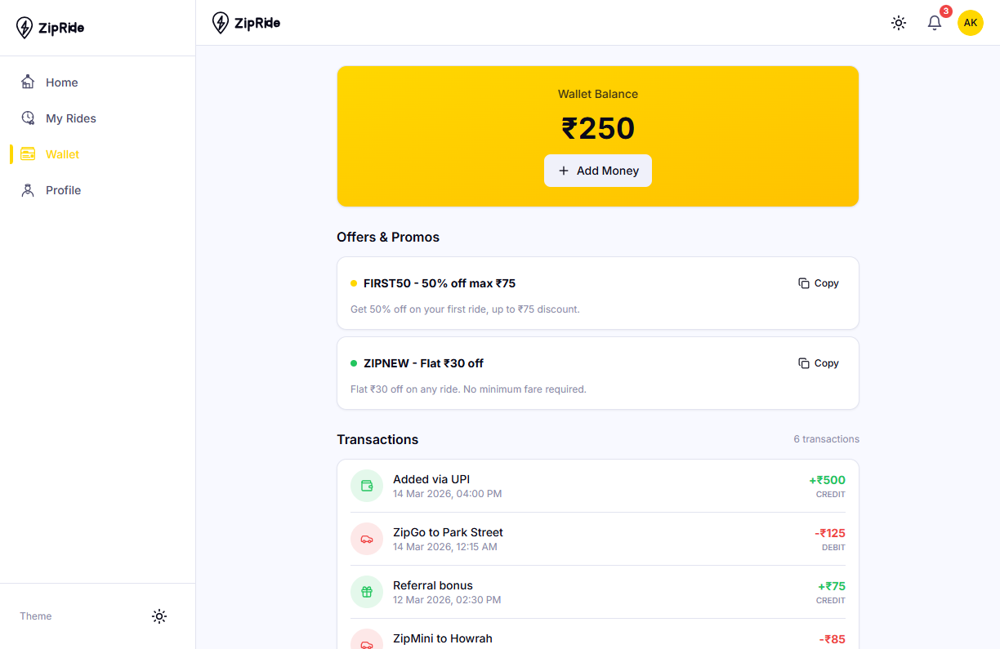
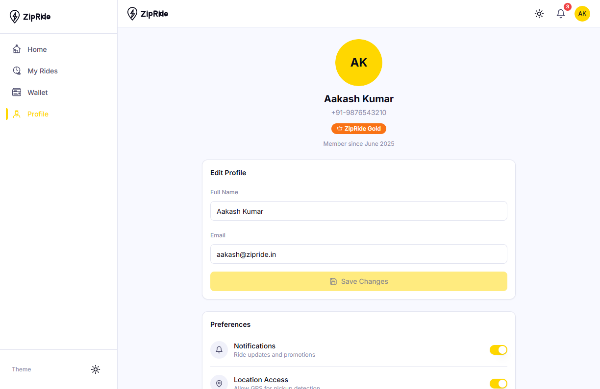
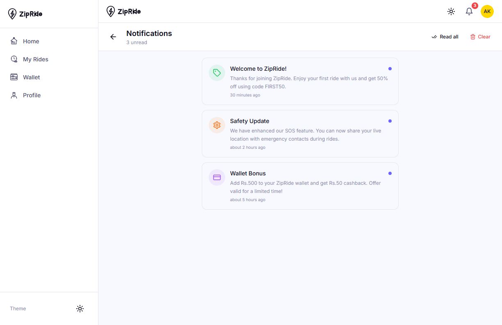

<p align="center">
  
</p>

<h1 align="center">ZipRide</h1>

<p align="center">
  A modern cab booking web app with route search, ride tracking, wallet, and profile management.
</p>

## Overview

ZipRide is a frontend-focused ride-booking experience built with React, TypeScript, and Vite. The app includes onboarding, map-based pickup and drop selection, booking flow screens, wallet transactions, notification center, and user profile settings.

## Tech Stack

- React 18
- TypeScript
- Vite 5
- Tailwind CSS
- React Router
- Zustand
- React Query
- Leaflet and React Leaflet
- Radix UI primitives
- Framer Motion
- Vitest

## Key Features

- Onboarding and authentication-ready flow
- Map-powered home experience with pickup context
- Destination search and recent locations
- Ride booking journey screens
- Wallet with promo codes and transaction history
- Notifications center
- Profile settings and preferences
- PWA-ready setup for app-like experience

## Screenshots

### 1. Onboarding



This screen introduces the product flow with a clear first-step message and navigation controls for the onboarding sequence.

### 2. Home Dashboard



The home dashboard combines map context, pickup location, quick destination chips, and recent rides for faster repeat booking.

### 3. Destination Search



The destination search view provides recent places and popular local destinations to shorten search time.

### 4. Wallet



The wallet screen shows balance, promo code cards, and a transaction timeline to make spend tracking transparent.

### 5. Profile



The profile area includes personal details, app preferences, and links to policy pages in one place.

### 6. Notifications



The notifications center highlights unread updates such as offers, safety updates, and account activity.

## Project Structure

```text
src/
  components/
  hooks/
  lib/
  pages/
  services/
  stores/
  types/
public/
  lottie/
  pwa-icons/
```

## Getting Started

### Prerequisites

- Node.js 18+
- npm 9+

### Install

```bash
npm install
```

### Run Development Server

```bash
npm run dev
```

### Build for Production

```bash
npm run build
```

### Preview Production Build

```bash
npm run preview
```

### Run Tests

```bash
npm run test
```

## Deployment

This project includes `vercel.json` and can be deployed to Vercel directly.

## License

This repository currently does not define a license file.
